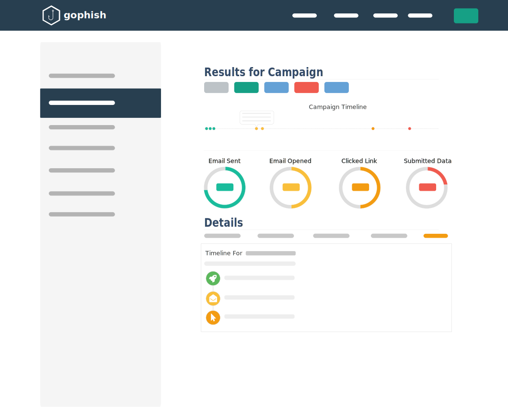
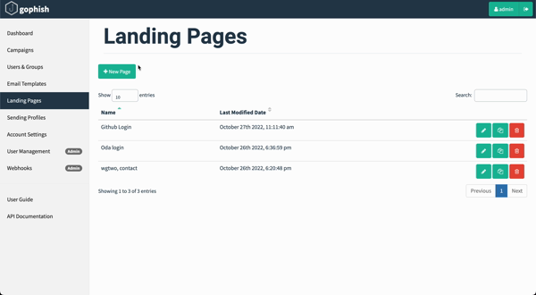

import Image from "@theme/IdealImage";
import styles from "./styles.css";
import Tooltip from '../components/tooltip/tooltip'

From:  **HR of WG2** <w272r84d4q @gmail.com>   
To: Your Name yourname@wgtwo.com  
Subject: Action required now for holiday party  
Date: Oct 21, 2022, 6:29 PM  

Hi! 

Working Group 2 is celebrating the holidays. To do so we need all WGTWO employees to sign up if they would like to receive a FREE gift. We have a limited number so need to here from you quickly. The wgtwo HR needs to know your answer by the end of this week so please signup on the link immediately <a href ="">HERE</a>.  

Thanks for your participation and patience. HR and CEO of WG2

<!--truncate-->

Hi! You either came here because a **wgtwo** internal phishing campaign phished you or you are interested in learning more about phishing! For whatever reason, welcome and we hope this blog post is useful for learning one or two things about this systematic problem - phishing. 

## Phishing and Social Engineering
Social engineering is a technique used to trick people into believing something untrue. For example, if one is pretending to be a janitor and walking past the security guard, or if one is tricking someone online to believe you are the CEO of their company. 

Over the internet, one can trick or phish people most commonly on social media, SMS, voice calls, websites, and email. Some of these phishing techniques are so popular that they receive specific names. For example, vishing relates to voice calls, and smishing relates to SMS. While these are very much relevant for **wgtwo** as we operate a mobile core network, today we will focus on the social engineering attack that is prominent via email called phishing. Furthermore, we will focus on how can we identify phishing emails, protect ourselves from phishing attacks, and provide insight into how a company could protect its employees by sharing our experiences. 
### Example phishing email
<!-- [image]() of a phishing email -->

From:  **HR of WG2** <Tooltip text="w272r84d4q@gmail.com" subtext="The sender is not from a wgtwo.com email" />  
To: Your Name yourname@wgtwo.com  
Subject: <Tooltip text="Action required now" subtext="Sense of urgency to trick you" /> for holiday party  
Date: Oct 21, 2022, 6:29 PM  

Hi! 

<Tooltip text="Working Group 2" subtext="Mispelling of the company name" /> is celebrating the holidays. To do so we need all <Tooltip text="WGTWO" subtext="Mispelling of the company name" /> employees to sign up if they would like to receive a <Tooltip text="FREE" subtext="nothing in life is for free ;)" /> gift. We have a limited number so need to here from you <Tooltip text="quickly" subtext="Sense of urgency to trick you" />. The wgtwo HR needs to know your answer by the <Tooltip text="end of this week" subtext="Sense of urgency to trick you" /> so please signup on the link <Tooltip text="immediately" subtext="Sense of urgency to trick you" /> <a href ="">HERE</a>.  
 
 
Thanks for your participation and patience. HR and <Tooltip text="CEO" subtext="Using authority to drive action" /> of <Tooltip text="WG2" subtext="Mispelling of the company name" />

### Common characteristics to phishing emails
- Email sender name is spoofed
- Misspellings
- Specific tasks that are abnormal
- Poorly formatted emails with weird or inconsistent fonts
- An attachment with a strange extension (as this is a mechanism for hiding from malware scanners)
- Urgency
- Using names of authority

## Why phishing

:::caution phishing
### 20% of all data breaches are caused by phishing
###### Report from [2022 Verizon data breach report](https://www.verizon.com/business/resources/reports/dbir/2022/summary-of-findings/) 
:::

Social engineering is an efficient way of stealing personal information and compromising internet resources making it such an effective way for “hacking” companies. 

From the perspective of a malicious actor, why would they try to exploit a vulnerability in a single system when they can just phish an employee into sharing their credentials who already have access to several systems?
> ## Effective, easy, and free

Today anyone can set up a new email account and begin sending emails from a verified, reputable email server - FOR FREE!

In addition, several websites configured with email authentication can be stolen and leveraged to send phishing malware from compromised devices and portals. 

## Phishing attacks
Generally, when people mention phishing, we are talking about email phishing. However, we have other types.

:::caution phishing
## Types of phishing attacks
- **Email Phishing**: sent via email
- **Spear phishing**: sent via email and targeted attack towards a company or set of people
- **Smishing**: sent via SMS
- **Vishing**: sent via voicecalls 
:::
### Spear phishing 
Spear phishing is a social engineering attack that targets a specific entity, company, or person. Generally speaking, these are targeted phishing attacks as they will alter the message to make it more relevant for the victim. For example, in a spear phishing email, the malicious actor would use the company logo, and other employee names within the company, leverage the company CSS and UI, and/or purchase a domain that resembles the target’s entity in all efforts for tricking the victim into sharing personal information such as login credentials.

Notably, in recent years there have been newsworthy events where spear phishing attempts have been successful in compromising companies. 

On [Sep 16, 2022, Uber experienced a social engineering attack](https://www.uber.com/newsroom/security-update/) that allowed the malicious actor to gain access to internal resources such as Slack, HackerOne, and several internal systems including a finance portal. This is an excellent example of how a group of hackers targeted an enterprise to compromise an employee's credentials to gain access to not just one system but several. Briefly mentioned in this report, Uber said that they are revising the MFA internal policies. This is a key control for preventing unauthorized access - which **wgtwo** continually implements and monitor across all applications.

Search engines are leveraged for easy data mining of company information that can be used in spear phishing attacks. 

One open-source tool that leverages search engines for information gathering of company data such as emails is baked into Kali Linux but also found on GitHub called [theHarvester](https://github.com/laramies/theHarvester). I can recommend checking it out!

### Smishing 
As discussed previously, smishing is a social engineering attack that is leveraging the SMS protocol for sending a malicious payload to the victim. 

Smishing is a very effective attack as the sms open rate is about 99%. With such a high open rate, it is almost certain that the SMS will be viewed by the victim if not blocked by the device or operator.

As **wgtwo** operates a mobile core network, one goal of ours is to protect the health of the SS7 network and the hygiene of SMS traffic. Ultimately, this led to us building an internal mechanism for identifying SMS spam. From this internal solution we identified that via malicious apps installed on a mobile device, smishing messages were propagated via that malicious app behind the scenes using the mobile device’s modem - unidentified by the end user. Essentially, leveraging the victim's device to re-propagate the phishing malware. Again, very similar to what we see in email phishing with a victim's email server or website getting compromised and then propagating phishing malware from this infected endpoint.
## Protect yourself
As much as email providers and clients try to prevent phishing messages from ending in your email inbox, it is bound that everyone will eventually receive a phishing message. Thus, it is up to us to ultimately stay protected from these social engineering attacks. Here are a few best practices to help you stay secure:

- Never share personal information such as your email address, password, or one-time-passcodes (OTPs)
- Don’t trust email. Anyone can send you an email.
- Learn the effective ways of detecting phishing emails like reviewing the sender address, misspellings in the email, and incorrect information - as mentioned previously in this blog post
- Keep your software up-to-date to help protect from vulnerabilities being exploited. This includes your web browser and operating system.
- If the phishing email is sent from the CEO of the company, for example - reach out to the CEO in another communication channel like slack or SMS to confirm the email is authentic
- Ask for help from colleagues, friends, or family if in doubt about an email

## Protect your company
### 2FA
Enabling 2FA today is a necessary step for the security of employee accounts and access. Take the scenario of an employee being phished and sending their login credentials to a malicious actor - well they don't have the one-time passcode that's generated on new unknown logins. Ultimately this mitigates the risk completely as the actor was unable to log in. Today we are seeing new solutions from apple and others that are building passwordless solutions. [Apple Passkeys](https://developer.apple.com/passkeys/) is an interesting solution as this leverages biometrics and your device to make an easy and secure way for authenticating.
### SPF DKIM and DMARC
An organization is responsible for properly configuring and managing email security. Many if not all email providers allow the configuration of email authentication to prevent the unauthorized sending of emails from your company's domain. 
- **SPF**: Specifies the servers and domains that are authorized to send emails on behalf of your organization.
- **DKIM**: Adds a digital signature to every outgoing message, which lets receiving servers verify the message came from your organization.
- **DMARC**: Let you tell receiving servers what to do with outgoing messages from your organization that doesn’t pass SPF or DKIM.
By adopting the above email authentication protocols one can create an allowlist for where they expect internal email to be originating from and a policy that tells what to do with an email that does not meet the authentication standard. This helps prevent spoofing and phishing emails originating and delivered to your employees 
### Internal phishing campaigns
We are an advocate of security through education. What might be common sense for someone is not for another. Learning is an interesting topic in itself but in reality, until one has spent the time to create an understanding or learn from an experience or event one might truly understand. However with phishing, one might know what it is and not say to click the link, but they still do that. Why might you ask? Well, we are all human and bound to make mistakes.

Our belief is internal phishing campaigns can be used as an educational exercise but should only be viewed as an educational tool - rather than - a way to purposely trick employees into “failing” an exercise. View the next section to learn more about how **wgtwo** approaches and build its internal phishing campaigns.
## How **wgtwo** performs internal phishing campaigns
As industry best practices recommend companies perform security awareness training continually and the growing security threat of phishing leads **wgtwo** to build the capability and perform internal phishing campaigns. For an effective phishing campaign we have a few guidelines we follow:

**Dos**
- Always inform employees before a phishing campaign via slack #security channel
- Make the phishing campaign educational

**Don’ts**
- Never blame an employee for clicking the link and falling a victim to the phishing campaign

In October 2022, during a **wgtwo** hack day, we decided to build some new automation for conducting an internal phishing campaign.
### Architecture for internal phishing campaigns
#### Tools

[Gophish](https://github.com/gophish/gophish) is an open-source phishing toolkit designed for businesses and penetration testers. It provides the ability to quickly and easily set up and execute phishing engagements and security awareness training.

Gophish is helpful for us because it has an API to help automate the process, with some cool features to track the delivery of emails and record who clicked the link for example. 

As part of our process of adopting Gophish we contributed back upstream   
- Build and publish to ghcr.io on merge https://github.com/gophish/gophish/pull/2644

#### Procedure
For every internal phishing campaign we take the following steps:

1. Send a notification in the #security slack channel that a new phishing campaign has been created for some time in the future
2. Fetch a recent list of employee names/email addresses from google admin via an API call
3. Upload to the Gophish server as a new email campaign via an API call
4. Create a new email and make it relevant for the time of year, recent events, etc. and as the payload, including the link to this blog post as security awareness training

### Example phishing campaign email
Can you spot the errors in this spear phishing campaign?

#### Gophish Campaign Landpage 
In Gophish we are able to "steal" the html/css of existing website sites to build our own landing page. The landing page purpose is the payload that is imbeded in the email to capture sensitive data like username and password.

 

#### Spear Phishing Email and Landing Page
 

**Email**
- always check the sender
- longer pressing on the link will popup a preview where you can see the true URL
- my name was in the email but this because it was a spear phishing - and still can't be trusted
- the source name said it was `Oda` but after inspecting the email it was actually from an outlook.com account

**Website**
- always check the URL to ensure it is from the trusted source
- leverage password managers as because the URL is not the true source, the password manager would not share the credentials
- install adblockers on your phone or computer and blocks adds

> Note: On iOS a lot of information is hidden from the user, but there are still tricks to identify the true source and metadata about the email and payload.

- longer pressing on the link will popup a preview where you can see the true URL
- my name was in the email but this because it was a spear phishing - and still can't be trusted
- the source name said it was `Oda` but after inspecting the email it was actually from an outlook.com account

 

