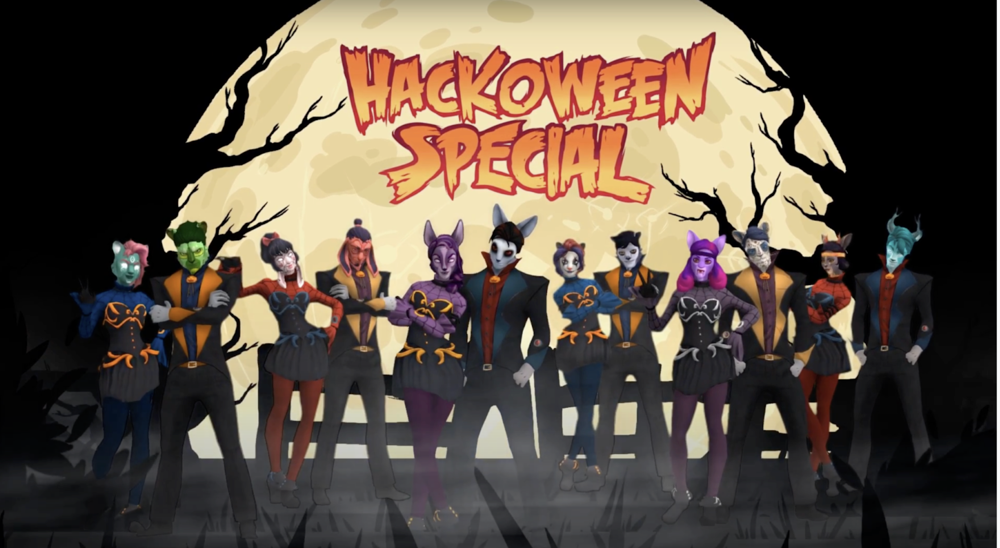

import ImgWithCaption from '../components/imgWithCaption'

Just as October was about to close, we ran a hackathon, aptly named "Hackoween" 🎃

Hackdays are a great way for everyone in the company to work together in creating new innovative solutions for everyday problems.

<!--truncate-->

This time, we had the joy of having a hackday that included 15+ teams and yes - *pizza*. As with anything these days, a hackathon is a mix of virtual and physical. 

# Hackday Presentations

## Building a system overview for wgtwo

*Team: Karl Johan, Anders, Tor, Oliver, Tobias*

Building a new "Telco 102" visualization of our system architecture - used for both internal onboarding and to aid us when we talk to customers. 

## MATRIX (MAximum TRacing with mInimal Xffort)

*Team: Karl Johan*

Side-project to see what we could get out of our Java/Kotlin services by utilizing existing projects. Utilize the setup the Infrastructure team has made in dev around opentelemetry and XRay. The idea is to improve tracing across the stack. 

## Gophish - for internal anti-phishing campaign

*Team: Jonny, Gunnar Inge*

The goal of this project is to deploy Gophish and setup a phishing campaign - to develop internal resilience against phishing attacks. Check out their guide to developing internal phishing campaigns [on our blog.](https://www.wgtwo.com/blog/internal-email-phishing-campaigns/)

## Walicy - (wasm policy resolving)

*Team: Noy, Bjørn N*

Write a library / sidecar to use wasm to implement policy resolving.

## VoWiFi

*Team: Konstantin, Yan, Anton, Fabricio*

To build a more cloud-native ePDG to enable Voice-over-WiFi. 

## Handover Machine 2000 (Hammer2000)

*Team: Holger, Sindre, Rune, Alain, Jacob*

For testing handover between two physical antennas a phone needs to move between the coverage of two antennas. This has historically been done by moving a human holding a phone between two antennas. We attenuenated the radio signal with a rotating BLANDA BLANK serving bowl from Ikea - remotely controlled, of course! 

In a bright future, we want a physical contraption that will move a phone between the coverage areas of the antennas. 

## Cloud PBX - call center

*Team: Sergey*

WTP and WebRTC-based minimalist PBX (with no SIP). 

## Explore Vite+Bazel(+Javalin/VuePress) for instant development feedback

*Team: Jørund, Tibor*

Seeking a smoother developer experience. The goal: instant changes (without reloading the page). 

## Easier voice deploys

*Team: Atanas* 

Even more flexibility in deploying voice infrastructure through IP-operator magic. 

## Improve visibility of the subscriber activity in our network

*Team: Tech support team, Nicholas, Pavel, Fabricio*

Dashboard showing subscriber activity and be able to drill down and filter the activity in a variety of ways. 

## Hackoween for beginners

*Team: Theresa, Oda*

What two non-hackers can achieve in three days (building an onboarding website).

## Kubernetes service canary (ish)

*Team: Didier*

POC of scripts to add/remove a canary pod to k8s services dynamically.

