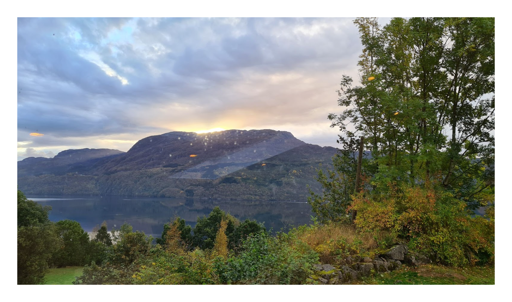

import ImgWithCaption from '../components/imgWithCaption'

Picture a secluded spot deep in a Norwegian fjord. As you wander past the main farmhouse, you come across a barn. Inside, there are no animals in sight. Instead of hay and manure, you're greeted by the aroma of freshly made hot chocolate. And there, sitting behind a computer, surrounded by screens and a lightning-fast internet connection, is Karl Johan Heimark.

<!--truncate-->

Karl Johan is the Engineering Manager for a team of 17 talented software engineers scattered across Europe and Asia. Based in the little-known village of Vanvik, his unique workplace is a world away from the bustling tech hubs of Silicon Valley, London or even Oslo.

How does he manage a team of engineers from the middle of nowhere? 

**In his own words:**

“Management and leadership are crucial in a distributed company, and it's easy to overlook their importance when things are running smoothly.”

“Lessons from Covid have shown that we were well-prepared as a distributed company from day one. We could continue to work much the same way as we already did. Covid didn't have a significant impact, but we did learn that doing social things, also in an online setting, is important to get people to know each other.”

<ImgWithCaption
  style={{
    width: "50%",
    float: "right",
    marginLeft:"20px"
  }}
  caption="To Vanvik from space"
  src={require("!file-loader!./earthtovanvik.gif").default}
  />

“The pandemic has accelerated the shift towards remote work, and I believe that distributed companies will continue to thrive in the future.”

“Managing teams from the middle of nowhere has been a learning experience. I've found that trying to be close day-to-day by listening and following what's going on in Slack and standups is crucial.”

“Having regular one-on-ones with my team members every two weeks helps me stay on top of things. I spend half of Thursday and half of Tuesday on this. We use a single slide to guide us on gauging motivation levels, reviewing development goals and discussing things that are going well, and things that aren't going well. We put the slide on the screen, so both of us can see it and comment.”

<ImgWithCaption
  style={{
    width: "50%",
    float: "right",
    marginLeft:"20px"
  }}
  caption="The four seasons of Vanvik"
  src={require("!file-loader!./vanvik4seasons.png").default}
  />

“The fact that every team, including the management, is distributed means that everyone is included. Nobody is left outside.”

“As a natural introvert, I've become more comfortable with being an extrovert. I find both talking one on one and to a bigger group a lot easier over video than in person. When we have company settings and I meet everyone, it's not a big deal anymore.”

“I can’t follow the water cooler chat in the offices, so I'm not necessarily colored by who talks the most in those settings. This makes me feel like I start meetings and one-on-ones with a cleaner sheet than I would in an office setting.”

“I do miss the dopamine I used to get from coding when I could solve problems quickly. Management means that you think and work with a longer-term perspective. My job is to facilitate and try to make people productive, engaged and happy. I’ve found that having a few old farm buildings to maintain makes for some great distracting physical work where I see the result quickly.”

<ImgWithCaption
  style={{
    width: "50%",
    float: "right",
    marginLeft:"20px"
  }}
  caption="Cats living the good cat life"
  src={require("!file-loader!./catsofvanvik.png").default}
  />

“Living with only farmers as neighbors I’ve gotten an immense amount of respect for the Norwegian farmer. I get very inspired by the work ethic, year-round planning and all-round skills that goes into keeping a farm running in the Norwegian fjords.”

“My location impacts me in a few ways. Being close to nature and being able to go for a hike summer or winter is a great way for me to recharge and clear my head. On the other hand, traveling anywhere is at least a half-day effort. It's a balance, and I've learned to appreciate the pros and cons of my location.”

<ImgWithCaption
  style={{
    width: "50%",
    float: "middle",
    marginLeft:"20px"
  }}
  caption="Cows are friendly, too!"
  src={require("!file-loader!./cows.gif").default}
  />

