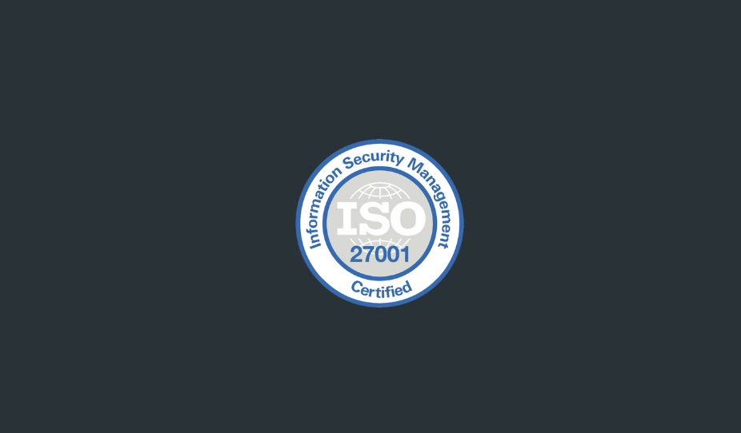
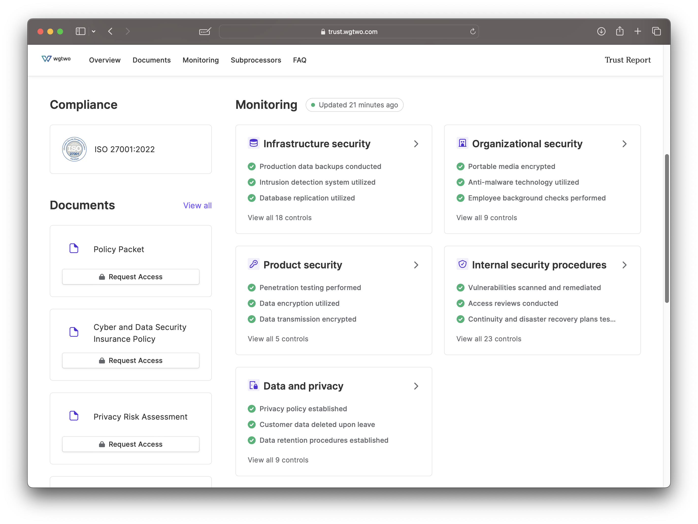

import Image from "@theme/IdealImage";
import styles from "./styles.css";
import Tooltip from '../components/tooltip/tooltip'

In today's digital age, cybersecurity is an ever-increasing concern for organizations worldwide. It's imperative to keep sensitive information safe from cybercriminals - especially as a telecom mobile core network. That's why we're thrilled to announce that Working Group Two has achieved the ISO 27001:2022 certification - a globally recognized standard for information security management systems. This latest accomplishment marks a significant milestone for our organization in ensuring the security of our telco core network and edge sites, protecting our customers' confidential data from any potential threats.

<!--truncate-->

Receiving the [ISO 27001:2022 certification](https://www.iafcertsearch.org/certified-entity/b173f6b7-3418-5050-875b-e513ecaece42) offers Working Group Two a host of benefits that are critical in today's rapidly evolving digital landscape. Firstly, it provides a robust framework to manage and protect sensitive information from any potential security threats. Secondly, it ensures the implementation of security controls to safeguard against cyber-attacks, data breaches, and other security incidents. Thirdly, it instills trust and confidence in our customers that we take data security seriously and have implemented the necessary measures to protect their information. Ultimately, achieving this certification demonstrates our unwavering commitment to information security and reinforces our position as a reliable and trustworthy partner to our clients.

:::tip ISO 27001:2022 Scope Statement
Working Group Two operates a mobile core network platform-as-a-service, enabling its customers to provide mobile telecom services using its core network. In addition, WG2 builds APIs to drive the programmability of the mobile core network. The scope of the ISO/IEC 27001:2022 certification is limited to the Information Security Management System (ISMS) supporting Working Group Two AS’s Software-as-a-Service (SaaS), Web application products, mobile telecom services in accordance with the Statement of Applicability version 1.0 dated 03/09/2023.
:::

## ISO 27001:2022

ISO 27001 released a new standard in 2022, succeeding their previous version from 2013, making it the newest and most comprehensive security standard that outlines [93 information security controls](https://docs.google.com/spreadsheets/d/1MpdbcFEmW5678L1SToJhf0UiC3mjcpSMStxbc_kDCxY/edit#gid=0) to safeguard against various risks and threats. These controls cover all aspects of information security, from policies and roles to the use of cryptography and network security. They address critical domains such as access control, authentication, secure coding, application security, vulnerability management, and incident management, to name a few. The standard also emphasizes the importance of compliance with legal, statutory, regulatory, and contractual requirements, ensuring that organizations maintain an up-to-date understanding of their obligations. By adhering to these controls, Working Group Two can significantly reduce its exposure to security risks and safeguard its sensitive data and assets against unauthorized access, theft, or misuse.

  
<b>ISO 27001:2022 Controls</b>

  

<table><tr><th>#</th><td>ID</td><td>Name</td></tr><tr><th>1</th><td>5.1</td><td>Policies for information security</td></tr><tr><th>2</th><td>5.2</td><td>Information security roles and responsibilities</td></tr><tr><th>3</th><td>5.3</td><td>Segregation of duties</td></tr><tr><th>4</th><td>5.4</td><td>Management responsibilities</td></tr><tr><th>5</th><td>5.5</td><td>Contact with authorities</td></tr><tr><th>6</th><td>5.6</td><td>Contact with special interest groups</td></tr><tr><th>7</th><td>5.7</td><td>Threat intelligence</td></tr><tr><th>8</th><td>5.8</td><td>Information security in project management</td></tr><tr><th>9</th><td>5.9</td><td>Inventory of information and other associated assets</td></tr><tr><th>10</th><td>5.10</td><td>Acceptable use of information and other associated assets</td></tr><tr><th>11</th><td>5.11</td><td>Return of assets</td></tr><tr><th>12</th><td>5.12</td><td>Classification of information</td></tr><tr><th>13</th><td>5.13</td><td>Labelling of information</td></tr><tr><th>14</th><td>5.14</td><td>Information transfer</td></tr><tr><th>15</th><td>5.15</td><td>Access control</td></tr><tr><th>16</th><td>5.16</td><td>Identity management</td></tr><tr><th>17</th><td>5.17</td><td>Authentication information</td></tr><tr><th>18</th><td>5.18</td><td>Access rights</td></tr><tr><th>19</th><td>5.19</td><td>Information security in supplier relationships</td></tr><tr><th>20</th><td>5.20</td><td>Addressing information security within supplier agreements</td></tr><tr><th>21</th><td>5.21</td><td>Managing information security  in the ICT supply chain</td></tr><tr><th>22</th><td>5.22</td><td>Monitoring. review and change management of supplier services</td></tr><tr><th>23</th><td>5.23</td><td>Information security for use of cloud services</td></tr><tr><th>24</th><td>5.24</td><td>Information security incident management planning and preparation</td></tr><tr><th>25</th><td>5.25</td><td>Assessment and decision on information security events</td></tr><tr><th>26</th><td>5.26</td><td>Response to information security incidents</td></tr><tr><th>27</th><td>5.27</td><td>Learning from information security incidents</td></tr><tr><th>28</th><td>5.28</td><td>Collection of evidence</td></tr><tr><th>29</th><td>5.29</td><td>Information security during disruption</td></tr><tr><th>30</th><td>5.30</td><td>ICT readiness for business continuity</td></tr><tr><th>31</th><td>5.31</td><td>Legal, statutory, regulatory and contractual requirements</td></tr><tr><th>32</th><td>5.32</td><td>Intellectual property rights</td></tr><tr><th>33</th><td>5.33</td><td>Protection of records</td></tr><tr><th>34</th><td>5.34</td><td>Privacy and protection of PII</td></tr><tr><th>35</th><td>5.35</td><td>Independent review of information security</td></tr><tr><th>36</th><td>5.36</td><td>Compliance with policies. rules and standards for information security</td></tr><tr><th>37</th><td>5.37</td><td>Documented operating procedures</td></tr><tr><th>38</th><td>6.1</td><td>Screening</td></tr><tr><th>39</th><td>6.2</td><td>Terms and conditions of employment</td></tr><tr><th>40</th><td>6.3</td><td>Information security awareness. education and training</td></tr><tr><th>41</th><td>6.4</td><td>Disciplinary process</td></tr><tr><th>42</th><td>6.5</td><td>Responsibilities after termination or change of employment</td></tr><tr><th>43</th><td>6.6</td><td>Confidentiality or non-disclosure agreements</td></tr><tr><th>44</th><td>6.7</td><td>Remote working</td></tr><tr><th>45</th><td>6.8</td><td>Information security event reporting</td></tr><tr><th>46</th><td>7.1</td><td>Physical security perimeters</td></tr><tr><th>47</th><td>7.2</td><td>Physical entry</td></tr><tr><th>48</th><td>7.3</td><td>Securing offices. rooms and facilities</td></tr><tr><th>49</th><td>7.4</td><td>Physical security monitoring</td></tr><tr><th>50</th><td>7.5</td><td>Protecting against physical and environmental threats</td></tr><tr><th>51</th><td>7.6</td><td>Working in secure areas</td></tr><tr><th>52</th><td>7.7</td><td>Clear desk and clear screen</td></tr><tr><th>53</th><td>7.8</td><td>Equipment siting and protection</td></tr><tr><th>54</th><td>7.9</td><td>Security of assets off-premises</td></tr><tr><th>55</th><td>7.10</td><td>Storage media</td></tr><tr><th>56</th><td>7.11</td><td>Supporting utilities</td></tr><tr><th>57</th><td>7.12</td><td>Cabling security</td></tr><tr><th>58</th><td>7.13</td><td>Equipment maintenance</td></tr><tr><th>59</th><td>7.14</td><td>Secure disposal or re-use of equipment</td></tr><tr><th>60</th><td>8.1</td><td>User endpoint devices</td></tr><tr><th>61</th><td>8.2</td><td>Privileged access rights</td></tr><tr><th>62</th><td>8.3</td><td>Information access restriction</td></tr><tr><th>63</th><td>8.4</td><td>Access to source code</td></tr><tr><th>64</th><td>8.5</td><td>Secure authentication</td></tr><tr><th>65</th><td>8.6</td><td>Capacity management</td></tr><tr><th>66</th><td>8.7</td><td>Protection against malware</td></tr><tr><th>67</th><td>8.8</td><td>Management of technical vulnerabilities</td></tr><tr><th>68</th><td>8.9</td><td>Configuration management</td></tr><tr><th>69</th><td>8.10</td><td>Information deletion</td></tr><tr><th>70</th><td>8.11</td><td>Data masking</td></tr><tr><th>71</th><td>8.12</td><td>Data leakage prevention</td></tr><tr><th>72</th><td>8.13</td><td>Information backup</td></tr><tr><th>73</th><td>8.14</td><td>Redundancy of information processing facilities</td></tr><tr><th>74</th><td>8.15</td><td>Logging</td></tr><tr><th>75</th><td>8.16</td><td>Monitoring activities</td></tr><tr><th>76</th><td>8.17</td><td>Clock synchronization</td></tr><tr><th>77</th><td>8.18</td><td>Use of privileged utility programs</td></tr><tr><th>78</th><td>8.19</td><td>Installation of software on operational systems</td></tr><tr><th>79</th><td>8.20</td><td>Networks security</td></tr><tr><th>80</th><td>8.21</td><td>Security of network services</td></tr><tr><th>81</th><td>8.22</td><td>Segregation of networks</td></tr><tr><th>82</th><td>8.23</td><td>Web filtering</td></tr><tr><th>83</th><td>8.24</td><td>Use of cryptography</td></tr><tr><th>84</th><td>8.25</td><td>Secure development life cycle</td></tr><tr><th>85</th><td>8.26</td><td>Application security requirements</td></tr><tr><th>86</th><td>8.27</td><td>Secure system architecture and engineering principles</td></tr><tr><th>87</th><td>8.28</td><td>Secure coding</td></tr><tr><th>88</th><td>8.29</td><td>Security testing in development and acceptance</td></tr><tr><th>89</th><td>8.30</td><td>Outsourced development</td></tr><tr><th>90</th><td>8.31</td><td>Separation of development. test and production environments</td></tr><tr><th>91</th><td>8.32</td><td>Change management</td></tr><tr><th>92</th><td>8.33</td><td>Test information</td></tr><tr><th>93</th><td>8.34</td><td>Protection of information systems during audit testing</td></tr></table>
  

## Leveraging automation

Working Group Two recognized the need for efficient and effective compliance validation of cloud and edge resources to meet the ISO 27001:2022 standard. The team leveraged automation and the DevSecOps methodology to automate the validation process to achieve this goal. Through automation, the team was able to efficiently validate the compliance of these resources and reduce the potential for human error. The DevSecOps methodology ensured that security was integrated throughout the development and operational processes, resulting in more secure and compliant cloud and edge resources. The combination of automation and DevSecOps allowed Working Group Two to streamline its compliance validation process and ensure that its resources met the ISO 27001:2022 standard.

## Responsible Disclosure Program

Implementing a [responsible disclosure program](/security/responsible-disclosure/) has been a crucial part in this process, prioritizing wgtwos security of all systems and data. By establishing a clear and easy-to-use reporting mechanism for security vulnerabilities, we can now work with security researchers and other external parties to quickly identify and address potential threats. A successful responsible disclosure program not only helps us to stay ahead of potential security incidents, but also demonstrates our commitment to transparency and collaboration in the broader security community.

## Our security speaks for itself

[trust.wgtwo.com](https://trust.wgtwo.com) is a comprehensive platform designed to provide customers and partners with easy access to information about Working Group Two's security controls and certifications. The platform offers a centralized location to access detailed security documentation and certifications, including ISO 27001:2022 compliance, which assures customers that Working Group Two has implemented comprehensive security controls to protect their data and infrastructure. Additionally, trust promotes transparency and trust between Working Group Two and its customers by enabling easy access to relevant security information. With this platform, customers can have a better understanding of the security measures Working Group Two has put in place to protect their information and ensure its privacy. Overall, trust serves as an essential resource for customers and partners who want to stay informed and up-to-date on Working Group Two's security measures and certifications.

<a href="https://trust.wgtwo.com" target="_blank">https://trust.wgtwo.com</a>
  

## We have joined the elite 0.056% of European Companies

:::note Only 0.056% European Companies are ISO 27001 Certified  
[22,112,982](https://www.statista.com/statistics/1248775/number-of-businesses-eu/) EU Companies  
[12,532](https://www.itgovernance.co.uk/blog/iso-27001-certification-figures-increase-by-20#:~:text=In%202016%2C%2033%2C290%20certifications%20were,certified%20to%20the%20Standard%20respectively.) EU Companies with ISO 27001  
:::

Now, in May 2023 we are [officially ISO 27001:2022 certified](https://www.iafcertsearch.org/certified-entity/b173f6b7-3418-5050-875b-e513ecaece42)! The journey to reach this milestone was definitely challenging but also a rewarding experience. This accomplishment would not be possible without the support of many individuals across the organization - big 👏

With the high ISO standard, we innovated a security posture via automating the validation of cloud and edge resources. Through our trust.wgtwo.com platform, we have established transparency with our customers and provided them with the ability to download certifications and security documentation. 

We are proud that Working Group Two, as one of a few, can display our ISO 27001:2022 certification today, demonstrating to our customers that security is at the forefront of how Working Group Two operates, and is the backbone of our core network.
