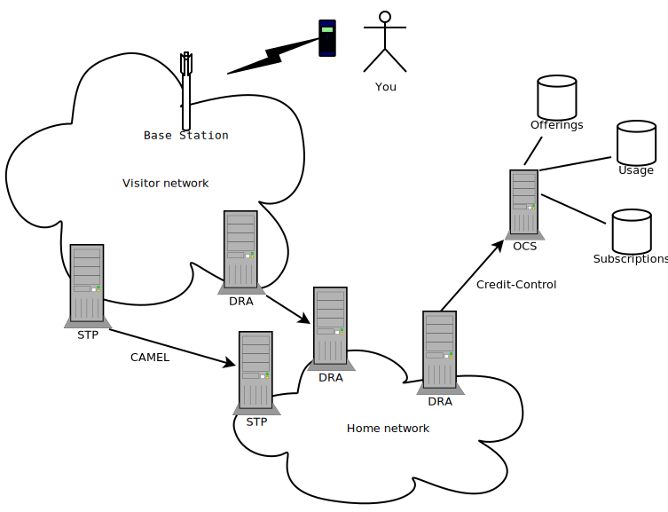

Sorry for the click-bait title, I couldn't resist.  

In this blog post I will describe online charging and go in depth on
the Credit-Control message, what it is used for, what it contains, and
where it is sent.

<!--truncate-->

# What is charging?

If you (as a user of telephone services, aka subscriber) want to make a
phone call, send SMS or use data services, then your operator wants to
know that you are able to pay for that action. This is called
charging, the method of collecting and checking the number of used
service units.

There is also the concept of billing that often goes hand in hand:
Invoicing you for those charged services units.

There are multiple plans which you can have, for instance you might
have a prepaid SIM-card where you top up your saldo in advance, or you
might have a subscription plan which allows for some services for a
fixed price.

The operators might handle the user's session with regards to charging
in two ways. Either they are using offline charging, or an online
charging system.

Offline charging cannot affect user sessions in real time, it
calculates the charging records after the session is finished and updates
the user's values. For instance you might get the invoice after the
month finishes with the cost of your usage.  In order to send the
invoice, the operator need to collect records of the user's usage,
these records are called Charging Detail Records, and acronymed CDRs.
The CDRs are sent from all the parts of the network that handles the
user's session. For instance the SMSGW node is collecting CDRs for
SMS-usage, a PGW for Data-usage, etc.

The other way is to have a online charging setup, where all the telco
nodes need to ask for credits at the moment the user is using the
services. The system that gets the request is called an Online
Charging System, or OCS in telco-lingo, and resides at the operator
control.  It is called online charging because it can actively affect
the user session in real time, i.e. block or allow user actions based
on the values and calculations in the OCS. The different systems sends
a request toward the OCS asking for some action, e.g. SMSGW might ask
the OCS if the user has credits enough to send a message.

Basically the OCS is a database storing information about prices of
the operators services, as well as keeping track of the user's credits.

The pricing is based per operator and could go for example something
like this

- 100 free SMSes, after that 1 SEK per SMS
- 60 free voice minutes, then 5:50 SEK per minute
- 1 GB free data transfered per week

All operators have different pricing models in order to compete with
each other, not one model fits all etc. Therefore the OCS node has a
lot of configuration parameters it can set. For instance if a
subscriber uses up all available data, should she be directed to a
top-up page to buy more data, or should the data usage be blocked or
rate-limited, and if she doesn't use up all data, should the remaining
data be added to a future pot, available only next period or until
used up?

This picture shows how you the subscriber and the OCS are located in
the network. Your phone connects to the antennas of the visiting
network. The visiting network is the network that owns the antennas
and spectrums, aka mobile network operator or MNO. In Sweden, it is one
of Telia, Tele2, Telenor, or Tre. In Germany it is Telekom, O2, or
Vodafone. Wikipedia has
[lists](https://en.wikipedia.org/wiki/List_of_mobile_network_operators#By_region)
if you want to check your country's MNOs.

When using one of the services provided, a bunch of requests are sent
from the visiting network to your home network, i.e. your operators
network. This network *could* be the same network as the visiting
network, but it doesn't have to. For instance if you have a Telenor
SIM-card, you could be in Telenors network if you are in Sweden, but
you could be in Telekoms network roaming if in Germany, or you could
have a Vimla SIM-card, which is an Swedish MVNO (virtual operator;
meaning they don't have their own licence for the radio bands, but
they have an agreement with Telenor to use their network.). It gets
complicated quickly and I've only mentioned the visiting and home
network (there are others, e.g. interrogating network).

Between the networks there are nodes called Sigtran Transfer Point
(STP) or Diameter Relay Agents (DRA), depending on which technology
you use. Their purpose are to connect between networks and route
messages between nodes. You can think of it as routers with advance
functionality for some specific protocols. I'm not going to go into
this much deeper, but I'll do mention some of the interfaces. I'll
start with the CAMEL interface (more specifically between the gsmSCF
[GSM Service Control Function] and gsmSSF [GSM Service Switching
Function] over the C-interface [XXX_SWO TODO: double check it's the
correct interface]).

CAMEL (Customized Applications for Mobile networks Enhanced Logic)
make it possible for a home network to receive updates of it's users
actions. As an example, when you start a call, the visiting network
will use CAMEL to send an InitialDP (user has entered a detection
point) message to the home network. The home network will then respond
with either Continue or Connect (if it accept the action) which lets
the user and visiting network to continue to set up the call, or the
home network can send a ReleaseCall message which denies the call to
be set up (or disconnects if the call is already set up).

In our setup (as in Working Group Two setup), the OCS is managed by a
third party, a partner with us and our customer, and so there are DRAs
connecting the third party network with our network as well.

The home network will apply online charging by sending
Credit-Control-Request messages to the OCS, which will lookup the
subscriber and the subscribers credits, and set the corresponding
pricing.

# What is the problem?

Disclaimer: These are all my personal thoughts, and there are probably
reasons the interface and messages are designed the way they are, that
I yet don't grasp.

In my opinion there are too many different usages and definitions for
the Credit-Control message, it is to general and reused in too many
different cases.

First out is the network interfaces. An interface is the definition of
how nodes talk to each other. It usually specifies which nodes are
involved, and which messages are allowed.  For instance the Ro
interface contains Credit-Control messages for SMS, MMS and voice
calls, between the IP Multimedia Subsystem (IMS) and the OCS.  There
is also the Gy interface between the Packet Gateway (PGW) and the OCS,
which also carries Credit-Control messages for data usage. As well as
the Gx interface which carries Credit-Control messages for... policy
control between PGW and the Policy and charging rules function (PCRF)
to create service session level policy decisions.

| Interface | Application-ID | Description                                | Nodes involved                    |
|-----------|----------------|--------------------------------------------|-----------------------------------|
| Base      | 4              | Diameter Credit-Control Application        | Any: Credit-Control Client/Server |
| Ro        | 4              | Online charging for SMS, MMS, voice calls  | IMS (CSCF), OCS                   |
| Gy        | 4              | Online charging for data services          | PGW (PCEF), OCS                   |
| Gx        | 16777238       | Policy control for data and voice services | PGW (PCEF), PCRF                  |

So even if we only focus on application for online charging, i.e. with
Application-ID set to 4, then we have the specifications for the
Credit-Control message.  There are multiple specifications, the base
Diameter defined in RFC4006, which can be used for any Diameter
application which would want to have online charging functions, as
well as the 3GPP (Telco) defined in TS 32.299, for how online charging
should work in telecommunication applications like the ones above.
3GPP TS 32.299 is actually split up into multiple specifications
depending on which service or context used, each defines a number of
"allowed fields" from TS 32.299 for the context.

E.g.
3GPP TS 32.251 for PS charging,
3GPP TS 32.253 for CPDT charging,
3GPP TS 32.254 for Exposure function API charging,
3GPP TS 32.260 for IMS charging,
3GPP TS 32.270 for MMS service charging,
3GPP TS 32.271 for LCS service charging,
3GPP TS 32.272 for PoC service charging,
3GPP TS 32.273 for MBMS service charging,
3GPP TS 32.274 for SMS service charging,
3GPP TS 32.275 for MMTel service charging,
3GPP TS 32.276 for VCS charging,
3GPP TS 32.277 for ProSe charging,
3GPP TS 32.278 for Monitoring Event charging,
3GPP TS 32.280 for AoC Service Information, and
3GPP TS 32.296 for ABMF Rc information

The Diameter base specification for credit-control RFC4006, and the
Telecom online charging specification 3GPP TS 32.299 specifications
are similar but different, let us compare the top fields in the
`Request` messages in Diameter dictionary form:

import styles from './index.module.css';

| Base Credit-Control-Request           | 3GPP TS 32.299 Credit-Control-Request |
|---------------------------------------|---------------------------------------|
| < Diameter Header: 272, REQ, PXY >    | < Diameter Header: 272, REQ, PXY >    |
| < Session-Id >                        | < Session-Id >                        |
| { Origin-Host }                       | { Origin-Host }                       |
| { Origin-Realm }                      | { Origin-Realm }                      |
| { Destination-Realm }                 | { Destination-Realm }                 |
| { Auth-Application-Id }               | { Auth-Application-Id }               |
| { Service-Context-Id }                | { Service-Context-Id }                |
| { CC-Request-Type }                   | { CC-Request-Type }                   |
| { CC-Request-Number }                 | { CC-Request-Number }                 |
| [ Destination-Host ]                  | [ Destination-Host ]                  |
| [ User-Name ]                         | [ User-Name ]                         |
| [ CC-Sub-Session-Id ]                 |                                       |
| [ Acct-Multi-Session-Id ]             |                                       |
| [ Origin-State-Id ]                   | [ Origin-State-Id ]                   |
| [ Event-Timestamp ]                   | [ Event-Timestamp ]                   |
| *[ Subscription-Id ]                  | *[ Subscription-Id ]                  |
| [ Service-Identifier ]                |                                       |
| [ Termination-Cause ]                 | [ Termination-Cause ]                 |
| [ Requested-Service-Unit ]            |                                       |
| [ Requested-Action ]                  | [ Requested-Action ]                  |
|                                       | [ AoC-Request-Type ]                  |
| *[ Used-Service-Unit ]                |                                       |
| [ Multiple-Services-Indicator ]       | [ Multiple-Services-Indicator ]       |
| *[ Multiple-Services-Credit-Control ] | *[ Multiple-Services-Credit-Control ] |
| *[ Service-Parameter-Info ]           |                                       |
| [ CC-Correlation-Id ]                 | [ CC-Correlation-Id ]                 |
| [ User-Equipment-Info ]               | [ User-Equipment-Info ]               |
|                                       | [ OC-Supported-Features ]             |
| *[ Proxy-Info ]                       | *[ Proxy-Info ]                       |
| *[ Route-Record ]                     | *[ Route-Record ]                     |
|                                       | [ Service-Information ]               |
| *[ AVP ]                              | *[ AVP ]                              |

A quick guide on how to read this:

- `< AVP >` indicates a mandatory Attribute-Value Pair with a fixed position in the message.
- `{ AVP }` indicates a mandatory Attribute-Value Pair in the message.
- `[ AVP ]` indicates an optional Attribute-Value Pair in the message.
- `*AVP` indicates that multiple occurrences of an Attribute-Value Pair is possible.

Each [Attribute-Value
Pairs](https://en.wikipedia.org/wiki/Name%E2%80%93value_pair) contain
information over each field in the message, and they can contain deep
structure with multiple (grouped) fields.

The last field named `*[ AVP ]` actually means that the message can
contain other arbitrary AVPs that are not mentioned, defined by the sender.

To comment on this, the messages are similar, but not compatible with
each other. The same goes for the comparison of the
sub-specifications, e.g. 3GPP TS 32.260 for IP multimedia subsystem
(IMS) charging, and 3GPP TS 32.276 for Voice Call Services (VCS)
charging; they are similar but not compatible.

We've just scratched the surface of these messages and applications,
but I'm already tired.

# Summary

Online charging as a concept is great to have in the portfolio, I
believe. My concern is that some of the telco protocols seem to be
have written by the same people behind the AUTOSAR specification.
Ambiguous, hard to understand, too many fields and different
interfaces, and vendors that does different things on top of it to get
their things to work...

(Sorry for being harsh to the people designing this, it's probably not
that easy).

What I would've liked is to split the messages and applications. 3GPP
online charging to get a separate application-id from base diameter
credit-control. Deprecation of TS 32.299 in favor of the context-based
specifications. It is too much things that happen in the current
protocol, specifications and messages.
