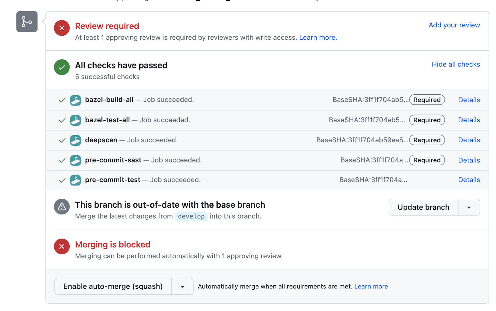

Our mobile core network enables operators to provide a scalable cloud-native solution with access to the SS7 core. We process voice, data, sms, and connectivity, naturally all very sensitive data. 

> Our goal is to build the most secure mobile core network. And to do so it all starts with our code. 

<!--truncate-->

## Situation: How to facilitate secure coding

Our primary objective is to create the most secure mobile core network. This journey begins by focusing on the quality of our code. We need to be able to identify and prevent misconfigurations and vulnerabilities that may inadvertently find their way into our codebase. Whether it's accidentally adding secrets to a repository or improperly sanitizing SQL statements, an effective solution is needed to identify and prevent these issues.

To align with a Secure Software Development Life Cycle (SSDLC), our approach involves shifting security controls to the early stages of development. Static Application Security Testing (SAST) is a vital methodology that analyzes code for security flaws and vulnerabilities. While there are both paid solutions like GitHub code scanning and free alternatives like trivy, semgrep, and kics, the key is to select the solution that best suits our needs, and sometimes more than one solution is necessary.

## Task: Developer-friendly + effective security tooling

Our task at hand is developing a developer-friendly solution that effectively implements security testing of code. To implement this we can break this into two parts. Part 1 is the “glue” that facilitates the process and the SAST toolchain itself.

### Requirements

We aim to implement SAST in a scalable, effective, and cost-friendly manner. Our requirements include:

- Supporting multiple languages (Kotlin, Go, Java, Erlang, JavaScript, Terraform, Kubernetes manifests)
- Easy local triggering by developers and CI
- Configurability to exclude specific directories, false positives, or accepted risks via comments
- Speed
- Identification of true positive findings
- Failing pull requests (PRs) and requiring developer intervention upon failure (for changed files)
- Scalability across different Git repositories


Having this set of requirements we naturally explored various solutions. When looking at solutions for implementing SAST effort + reward was always in the back of mind. How can we implement a solution with the least amount of effort and local tooling that provides the reward of securing our code base? 

SAST toolchains aside, we needed to first solve the question, of how will we run our security SAST toolchains in our codebase.

### Integration of SAST toolchain + CI/CD

#### The high effort and a high reward

While we leverage Bazel for unit and integration tests, adopting SAST within this framework posed certain limitations. Managing toolchains and ensuring the availability of specific binaries proved challenging. Furthermore, Bazel lacked easy access to changed files and seamless integration with open-source tools. While not impossible, this approach seemed to require substantial effort for a high reward.

#### The low effort with a high reward

Previously wgtwo has adopted pre-commit, a framework that is native to git, for implementing linting as part of the git commit process. We have various checks such as removing white spacing or format terraform, kotlin, java, etc. This framework seems like a perfect place to explore implementing SAST toolchains as it has insight into changed files via git and supports running binaries and Docker images.

With this new approach in mind, we could integrate "pre-commit" as the entry point for running our chosen SAST toolchains. Let's dive deeper into the evaluation and selection of the ideal SAST toolchains that fulfill our requirements.

## Action: SAST Toolchains

### Evaluating open-source SAST tools

Our evaluation focused on open-source toolchains. Open-source frameworks tend to be more flexible than paid options, and they avoid the overhead of sales interactions. We aimed to ensure compatibility with the "pre-commit" framework and flexibility to align with our evolving codebase and attack surface.

|                                                                                                    |         |        |       |              |              |              |
| -------------------------------------------------------------------------------------------------- | ------- | ------ | ----- | ------------ | ------------ | ------------ |
| Criteria                                                                                           | Semgrep | PEST   | Gosec | Trivy        | KICS         | Terrascan    |
| Supports our languages (kotlin, go, java, Erlang, JavaScript, terraform, k8s manifests)            | ✅       | Erlang | Go    | Terraform, k8s | Terraform, k8s | Terraform, k8s |
| Pre-commit hook already supported                                                                  | ✅       | ❌      | ❌     | ❌            | ❌            | ✅            |
| Supports whitelisting and excluding vulnerabilities with accepted risk (excluding rule + function) | ✅       | ❌      | ✅     | ❌            | ✅            | ✅            |
| Pre-crafted rules aligned to frameworks (CIS, OWASP)                                               | ✅       | ❌      | ❌     | ✅            | ✅            | ✅            |
| Provides value and false negatives                                                                 | ✅       | ✅      | ✅     | ✅            | ✅            | ✅            |

<center><i>Diagram evaluating SAST toolchains</i></center>


### SAST winner: `Semgrep` + `PEST`

Based on our analysis, Semgrep emerged as the winner. It supported common rule frameworks, including Gosec, and demonstrated compatibility with all languages. Future plans involve exploring the creation of custom rulesets that align with ISO 27001:2022 standards.


### Integrating SAST toolchains with pre-commit

**Semgrep**  
Semgrep supports and manages a [.pre-commit-hook.yaml](https://github.com/returntocorp/semgrep/blob/develop/.pre-commit-hooks.yaml#L6) with two options (binary or docker image). We opted in for using the binary integration as from testing there were some clear speed improvements. 

**PEST**  
PEST Pre-commit hook <https://github.com/omnicate/pre-commit-erlang-pest> 

This custom hook that we built has some logic to identify if dependencies are available on the host, if not it will default to use a docker image. This is useful for a controlled environment when running this SAST toolchain on CI or on developer machines.

Here is our `.pre-commit-config.yaml` that implements our new SAST toolchains.

`.pre-commit-config.yaml`
```bash
repos:
  - repo: https://github.com/omnicate/pre-commit-erlang-pest
    rev: v1.0.4
    hooks:
      - id: pest
  - repo: https://github.com/returntocorp/semgrep
    rev: v1.23.0
    hooks:
      - id: semgrep
        name: "SAST:semgrep-ci (exclude findings with commenting) [# nosec]"
        exclude: ".+test.+$|.+presentations.+$"
        args: [
          '--config=p/ci',
          '--metrics=off',
          '--severity=ERROR', # info, warning, or error
          '--exclude-rule=html.security.plaintext-http-link.plaintext-http-link', # TLS handled by proxy
          '--error', # Exit 1 if there are findings
        ]
        types_or: [javascript, go, python, java, kotlin, ts, bash, terraform, dockerfile]
        stages: [manual]
      - id: semgrep
        name: "SAST:semgrep-owasp-top-10 (exclude findings with commenting) [# nosec]"
        exclude: ".+test.+$|.+presentations.+$"
        args: [
          '--config=p/owasp-top-ten',
          '--metrics=off',
          '--severity=ERROR', # info, warning, or error
          '--exclude-rule=go.lang.security.audit.net.use-tls.use-tls', # TLS handled by proxy
          '--error' # Exit 1 if there are findings
        ]
        types_or: [javascript, go, python, java, kotlin, ts, bash, terraform, dockerfile]
        stages: [manual]
      - id: semgrep
        name: "SAST:gosec (exclude findings with commenting) [# nosec]"
        exclude: ".+test.+$|.+presentations.+$"
        args: [
          '--config=p/gosec',
          '--metrics=off',
          '--severity=WARNING', # info, warning, or error (all rules are listed as WARNING for gosec)
          '--exclude-rule=go.lang.security.some.semgrep.rule.here', # low risk
          '--error' # Exit 1 if there are findings
        ]
        types_or: [go]
        stages: [manual]
      - id: semgrep
        name: "SAST:semgrep-xss (exclude findings with commenting) [# nosec]"
        exclude: ".+test.+$|.+presentations.+$"
        args: [
          '--config=p/xss',
          '--metrics=off',
          '--severity=WARNING', # info, warning, or error
          '--error', # Exit 1 if there are findings
        ]
        types_or: [javascript, go, python, java, kotlin, ts]
        stages: [manual]
```

Some features in the configuration include:

- selection of a configuration ruleset
- specifying rule severity to limit false positives
- global rule exclusion
- file type-based hook execution using `types_or`


### Integrating pre-commit with Prow ci

Our CI transitioned from Concourse to Prow, offering superior benefits. Another blogpost on this should come in the future. For making this pipeline work effectively and quickly, a custom image with pre-loaded dependencies is used, and the following script triggers pre-commit in a Prow job:

```bash
function run_pre_commit() {
  if [[ "$JOB_NAME" == "pre-commit-sast" ]]; then
    IFS=',' read -ra IDS <<< "semgrep,pest" # update to add new SAST pre-commit hooks
    HOOK_STAGE="manual"
    for ID in "${IDS[@]}"; do
        PRE_COMMIT_COMMAND="pre-commit run $ID --from-ref=HEAD~1 --to-ref=HEAD --hook-stage=$HOOK_STAGE --color=never --show-diff-on-failure"
        echo ">>> $PRE_COMMIT_COMMAND"
        if ! $PRE_COMMIT_COMMAND | tee -a $GH_COMMENT_METADATA; then
            echo "pre-commit failed to run"
            clean_and_exit 1
        fi
    done
    return
  fi
  HOOK_STAGE="commit"
  PRE_COMMIT_COMMAND="pre-commit run --from-ref=HEAD~1 --to-ref=HEAD --hook-stage=$HOOK_STAGE --color=never --show-diff-on-failure"
  echo ">>> $PRE_COMMIT_COMMAND"
  if ! $PRE_COMMIT_COMMAND | tee -a $GH_COMMENT_METADATA; then
    echo "pre-commit failed to run"
    clean_and_exit 1
  fi
}
```

### Making the SAST checks required in GitHub

For that final piece of the puzzle we need to enforce the SAST check for future PRs. This can be done by the GitHub admin for the organization and is explained in the [GitHub documentation](https://docs.github.com/en/repositories/configuring-branches-and-merges-in-your-repository/managing-protected-branches/managing-a-branch-protection-rule).

To ensure SAST checks are mandatory for PRs, GitHub admins for the organization can enforce it. 

## Result

  

We are excited to say we have SAST checks as required checks for our code base. This shifts security to the left and reduces time and complexity for fixing future vulnerabilities. Our rulesets will evolve alongside our codebase and expanding attack surface. This solution is a stepping stone toward a more secure tomorrow, focusing on preventive security measures that empower developers rather than restricting them. By enabling developers, we enable ourselves to build a more secure future.
