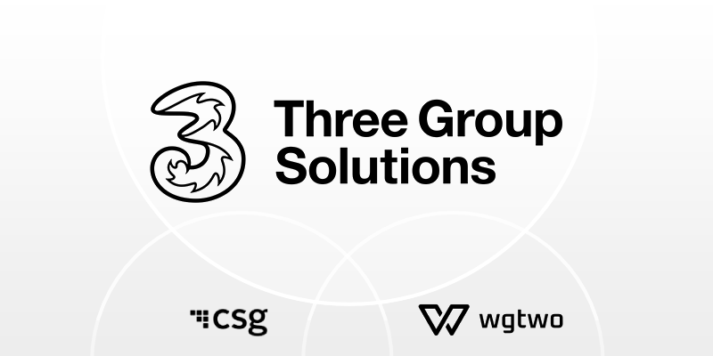

import Image from "@theme/IdealImage";
import Tooltip from '../components/tooltip/tooltip'

Three Group Solutions transformed its MVNE platform with a fully cloud-native, complete mobile solution with help from AWS Partners CSG and Working Group Two (WG2). Working with CK Hutchison’s 11 mobile operators across Europe and Asia, the mobile virtual network enabler faced challenges with an aging infrastructure, complex vendor relationships, and prolonged onboarding processes. By adopting CSG Ascendon from CSG as its business support system and WG2 as its mobile core network, Three Group Solutions adopted a modern, cloud-native environment running on Amazon Web Services (AWS). Now, it can onboard customers in 6–8 weeks, monetize services, and embrace modern business models with unparalleled agility.

<!--truncate-->

### Innovating to Meet Customer Needs and Stay Competitive in an Evolving Industry

The telecommunications industry is changing as technologically advanced competitors challenge traditional companies and outdated systems. In this environment, [Three Group Solutions](https://threegroupsolutions.com/) sought to meet rapidly changing customer demands and accelerate time to market.

Recognizing the need to embrace the cloud and software-as-a-service (SaaS) models, the company turned to AWS Partners. To build a complete, fully cloud-native solution, the company engaged [CSG](https://www.csgi.com/), an [AWS Partner](https://partners.amazonaws.com/partners/001E000001eMo9dIAC/CSG) that specializes in business support systems (BSS), and [Working Group Two](https://www.wgtwo.com/) (WG2), an [AWS Partner](https://partners.amazonaws.com/partners/0010h00001ZY6fDAAT/Working%20Group%20Two%20As) that delivers a mobile core network platform as a service.  

 

> ### “With CSG and WG2 solutions on AWS, we can onboard customers in 6–8 weeks instead of 9 months.”  
> 
> <small><strong>Tom Gardner</strong></small> 
> <small>Director of Enterprise, Wholesale, and IoT Products, Three Group Solutions</small>

 

### Using Cloud Operating Models to Upgrade an Aging System for Three Group Solutions

Three Group Solutions aggregates global mobile network assets owned by its parent company, [CK Hutchison Holdings Limited](https://www.ckh.com.hk/en/global/home.php) (CK Hutchison), with wholesale, enterprise, and Internet of Things (IoT) solutions. The company helps CK Hutchison’s mobile operators boost their margins and deliver new solutions, but its aging mobile virtual network enabler (MVNE) environment hindered efforts to grow its wholesale business and improve agility.

“Imagine having over 30 suppliers, each reaching their end of service at different intervals,” says Duminda Sudusinghe, general manager at Three Group Solutions. “We were constantly making updates and coordinating with customers and operators. This made the process increasingly unmanageable.”

To maximize the full potential of its networks, Three Group Solutions needed a modern cloud environment. It discovered that with cloud solutions from CSG and WG2, barriers to innovation are lowered. The company could entrust the AWS Partners with infrastructure management and upgrade coordination while it focused on monetizing core offerings, like white-labeled mobile virtual network operator (MVNO) services.  

### Harnessing AWS Partner Platforms to Modernize Core Network, BSS, and Online Charging Solutions

In 2019, Three Group Solutions joined forces with CSG and adopted [CSG Ascendon](https://aws.amazon.com/marketplace/pp/prodview-mmdsbie53qmcc/) as its BSS to manage billing, payments, customer support, and reporting for its MVNO customers. This cloud-native digital BSS solution is powered by several AWS services, particularly [AWS Fargate](https://aws.amazon.com/fargate/)—a serverless, pay-as-you-go compute engine.

Different CSG modules use many other AWS services, such as [Amazon Relational Database Service](https://aws.amazon.com/rds/) (Amazon RDS), a collection of managed services that make it simple to set up, operate, and scale databases in the cloud, and [Amazon MSK](https://aws.amazon.com/msk/), which makes it easy to ingest and process streaming data in real time with fully managed Apache Kafka.

By 2021, the company engaged WG2 to deploy its mobile core network on the cloud, delivering simplicity, improving operational efficiency, and gaining the ability to quickly develop new initiatives to meet market needs. The WG2 core delivers a full set of capabilities and network functions on AWS for subscriber authentication, provisioning, policy control, packet core, voice, and messaging.

Together with these AWS Partners, Three Group Solutions built a complete mobile core network with online charging and BSS in the cloud. This project involved a complete transformation of the company’s cloud architecture and introduced network-as-a-service deployment.

In the cloud, Three Group Solutions gained tools to enhance operational efficiency, optimize resource allocation, and scale on demand. The subscriber migration to the cloud was managed with low service impact, improving existing customers’ confidence in the new solution.

Three Group Solutions adopted a multitenant cloud model, which can deliver both the core network and BSS as services, even for multicustomer business-to-business-to-everything operations. It also integrated real-time charging functionalities to run diverse and competitive pricing models at scale. The system supports a wide network spectrum, from 2G to 5G, and delivers voice, data, and messaging services seamlessly to subscribers globally.

With this joint WG2 and CSG solution, Three Group Solutions can navigate varied MVNO business demands. Quarterly updates from CSG Ascendon, coupled with the ability to customize offers, mean that the company can respond to market changes and launch new products faster. This adaptability is enhanced by the continual introduction of new AWS services and WG2’s release strategy, where new capabilities are added on an ongoing basis.

“CSG’s BSS SaaS solution on AWS is the future for telecommunications providers transitioning to technology companies, driving innovation through digital marketplaces,” says Sean Casey, senior vice president of product management at CSG.  

### Growing Customers by Five Times in 2 Years with a Complete Cloud Network

With the help of CSG and WG2, Three Group Solutions is paving the way for future growth. This innovation at scale, built on robust cloud infrastructure, has transformed the way that it serves clients. “Before, each new customer needed a unique build from scratch,” says Tom Gardner, director of enterprise, wholesale, and IoT products at Three Group Solutions. “Now, most of the setup is common for everyone, and only the final 20 percent is customized. This new method is more efficient, cheaper, and easier for us and our clients.”

By optimizing operations in the cloud, Three Group Solutions is already seeing results. “We have reduced third-party vendors by 80 percent and maintained a consistently lean team despite growing by five times in less than 2 years,” says Gardner. “With CSG and WG2 solutions on AWS, we can onboard customers in 6–8 weeks instead of 9 months.”

Built on the cloud and delivered as a service, Three Group Solutions’ mobile core network facilitates simplicity, cost-efficiency, and a continual evolution of capabilities and features. As a result, it can innovate faster.

“A powerful, scalable, secure, and globally consistent infrastructure on AWS is a key driver for growth, lower costs, and new business models in telecommunications,” says Erlend Prestgard, CEO of WG2. “More than just efficiency gains, it opens up whole new operating and delivery models and prepares the ground for global mobile platforms and marketplaces. Three Group Solutions is at the cutting edge of this development and will benefit from being an early mover.”

With a cloud-native architecture, Three Group Solutions’ business now continually evolves and scales, as does the platform supporting it, with enhanced redundancy and no end of life. The company can support the most intricate partner relationships, which in turn makes it simpler to monetize connectivity at scale and onboard new customers.

Looking ahead, Three Group Solutions aims to extend its offerings beyond MVNOs and to its IoT and industrial wireless customers—thus paving the way for continual innovation and enhanced customer service in the ever-evolving telecommunications sector.
