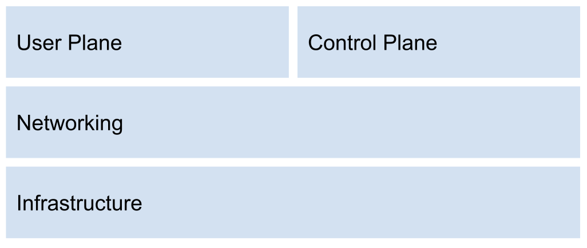

Private networks are a booming part of telecom. Use cases related to latency, security, and stability drive demand for smaller mobile networks. However, mobile networks are complex to manage. According to a study made by Omdia 9 out of 10 enterprises are looking for someone to partner with in managing these networks.

#### Infrastructure hyperscalers can accommodate small start-ups as well as the biggest enterprises. Why can’t the same be true for core network providers?

However, the equivalent simply isn’t true for core networks in the mobile industry. Traditionally, the complexity of a core has not allowed for the economics of smaller networks. This has resulted in specific small-scale product lines with reduced functionality. 

:::tip our vision
We believe we can do better, and through a combination of pre-integrated nodes, distilling the core to a set of APIs and our as-a-service model allows us to offer MNO grade functionality at small-scale economics.
:::

In other words, enterprises, system integrators and operators can get the functionality of a MNO-grade core in an affordable scaled down version suitable for smaller deployments. This also means that the operations, security and monitoring built for full MNO deployments is also applied to small networks. The native multi-tenancy allows easy creating and management of individual customers.

## Private networks background

Telco private networks are communication networks that are built and managed by telecommunications companies (telcos) for their enterprise customers. These networks are designed to provide dedicated and secure connectivity between different sites or branches of an organization, allowing them to transfer data, voice, and video traffic securely and efficiently. Telco private networks can be configured to offer various services, such as virtual private networks (VPNs), voice over internet protocol (VoIP), cloud connectivity, and managed network services. These networks can be customized to meet the specific needs and requirements of businesses, providing a reliable and secure platform for their communication needs.

A dedicated mobile network is available to cater to private entities, including corporations, factories, and educational institutions. The primary objective of a Private Network is to replace WiFi. In Japan, this technology has been successfully utilized to substitute legacy PBX systems, and it offers enhanced security features through the use of a required SIM card. Additionally, it can be applied to video surveillance purposes as it is a more secure alternative to WiFi.

Private networks are not interconnected with public networks such as Diameter or Sigtran. Traditionally, a single G (4G or 5G) is offered, which provides a range of telecommunication services, including VoLTE, VoNR, VoWIFI, data, and SMS.

Private networks offer organizations greater control over the user and control planes, allowing for more customization and optimization for specific applications or use cases. For example, an organization may want to prioritize the user plane for video traffic to ensure a high-quality video conferencing experience. With private networks, the organization can allocate resources and prioritize traffic to achieve this goal.

## Comparing Private Networks vs Traditional Telco Networks

- Private networks are built and operated by a specific organization for its internal use, while traditional telco networks are built and operated by telecommunication companies for public use.
- Private networks offer dedicated and secure connectivity, ensuring the privacy and confidentiality of data transmitted within the organization, while traditional telco networks offer shared connectivity.
- Private networks provide greater control over network performance and security measures, allowing organizations to customize their network according to their specific needs and requirements, while traditional telco networks are standardized and offer limited customization options.
- Private networks have lower latency and higher throughput compared to traditional telco networks due to their dedicated nature and better control over network performance.
- Private networks are not subject to public network regulations and can be optimized for specific applications or use cases, while traditional telco networks must adhere to regulatory requirements and serve a broad range of applications and use cases.

In addition, private networks offer greater security for both the user and control planes. The user plane is more secure than traditional public networks since it is isolated and not accessible to the public. The control plane is also more secure since it is only accessible to authorized personnel, making it more difficult for unauthorized parties to interfere with network operations. Overall, private networks offer organizations greater control and security over the user and control planes, allowing for a more customized and secure network environment.

## Private Networks Components: User Plane, Control Plane, Networking, Infrastructure

The user plane and control plane are particularly critical components of the system. The user plane is responsible for transmitting data between the end user and the network. It is essential to ensure that the user plane is secure, as it is the primary target of attackers seeking to intercept or manipulate data. On the other hand, the control plane is responsible for managing the network and establishing communication between network components. It is imperative that access to the control plane is restricted to authorized personnel only, as any interference could have a significant impact on network operations.

### User Plane

The user plane, also known as the data plane or bearer plane, is responsible for transmitting user data between the user's device and the network's core infrastructure. This plane handles the actual transmission of voice, video, and data traffic, providing a reliable and efficient transport mechanism for user traffic. In private networks, organizations have greater control over the user plane, allowing them to prioritize traffic and allocate resources to optimize specific applications or use cases.

### Control Plane

In contrast, the control plane is responsible for managing the signaling and control functions of the network. It establishes, maintains, and releases connections between different parts of the network and manages network resources such as bandwidth and radio channels. In private networks, the control plane is more secure and accessible only to authorized personnel, making it more difficult for unauthorized parties to interfere with network operations.

### Networking

Networking plays a crucial role in managing the network and facilitating communication between WG2 network components and edge devices. To ensure the security and integrity of the network, it is essential that access to the networking plane is restricted to authorized personnel and systems. Any unauthorized interference in the networking plane could significantly disrupt network operations and potentially be exploited by malicious actors to gain lateral access.

Given the critical nature of the networking plane in managing the network, it is essential to implement robust security protocols to protect against potential threats and attacks. This can include strategies such as network segmentation, access control mechanisms, intrusion detection and prevention systems, and regular security audits and assessments. By proactively mitigating the risk of attack and ensuring the security of the networking plane, organizations can help safeguard the integrity and availability of their private network infrastructure.

### Infrastructure

Infrastructure plays a vital role in the secure and efficient operation of private networks, particularly when utilizing cloud-based solutions such as the Amazon Web Services (AWS) platform and Kubernetes container orchestration system. AWS provides a highly secure, scalable, and flexible infrastructure to host private network components and applications, while Kubernetes enables efficient management and deployment of containerized workloads.

However, it is essential to ensure that the infrastructure is configured and maintained in a secure manner to prevent potential threats and attacks. This includes implementing robust access control measures, such as role-based access control (RBAC), network segmentation, and encryption of sensitive data at rest and in transit. In addition, regular security audits and assessments can help identify potential vulnerabilities and ensure that best practices are being followed to mitigate risk.

When using Kubernetes, it is important to ensure that the container images used in the private network are regularly updated and scanned for security vulnerabilities. Additionally, implementing security policies and enforcing best practices such as least-privilege access and regular backups can help protect against data loss and potential security breaches.

Overall, a secure and well-maintained infrastructure is essential to the successful operation of private networks utilizing AWS and Kubernetes. By proactively mitigating the risk of attack and implementing best practices to ensure the security and integrity of the infrastructure, organizations can effectively leverage these technologies to enable a secure and efficient private network environment.
